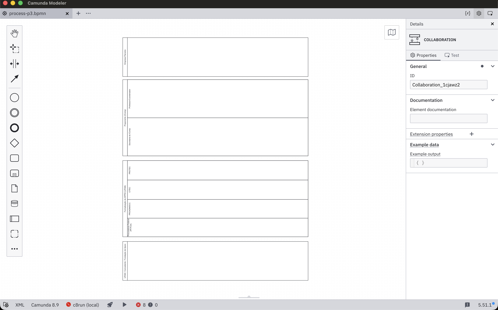
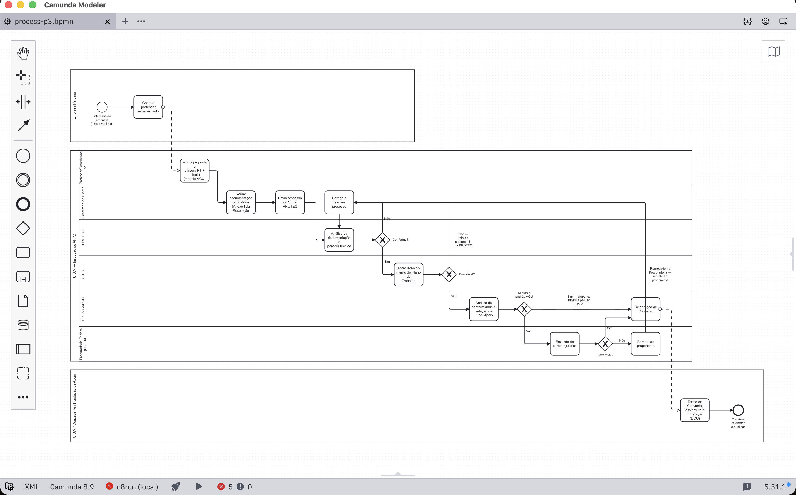
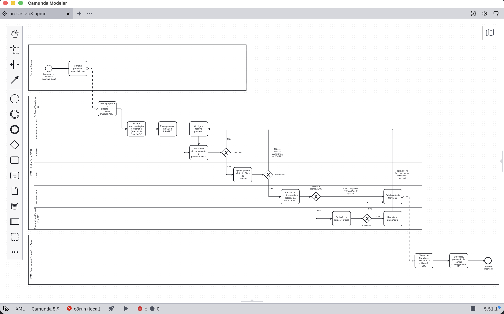

# TP1 — P3: Tramitação dos processos de P&D (BPMN)

ICC412 — Processo de Desenvolvimento de Software · 2026/2 · Prof. Leonardo Marques
Entregável **E1** (Diagrama BPMN) — responsabilidade do Integrante 2.

Modelagem do fluxo de celebração de Acordos de Parceria para Pesquisa, Desenvolvimento
e Inovação (APPDI) do IComp/UFAM: do interesse de uma empresa parceira até a assinatura
e publicação do convênio.

## Estrutura

```
diagrama/
  process-p3.bpmn   ← arquivo nativo (abrir no Camunda Modeler ou bpmn.io)
  process-p3.png    ← exportado em alta resolução
  process-p3.pdf    ← exportado em alta resolução
```

## Como abrir / editar

1. Instale o [Camunda Modeler](https://camunda.com/download/modeler) (gratuito).
2. Abra `diagrama/process-p3.bpmn`.
3. Ao salvar (`Cmd+S`), o Modeler sobrescreve o mesmo arquivo — o histórico de
   versões é mantido pelo git (ver abaixo), não por cópias manuais do arquivo.

## Fontes usadas na modelagem

- `ICC412_TP1_Especificacao.pdf` — enunciado do trabalho.
- Entrevista com a Socorro (Secretaria do IComp), realizada em 10/09/2026.
- **Resolução CONSAD-UFAM nº 047, de 12/11/2024** (Processo nº 055/2024-CONSAD,
  SEI 23105.041071/2024-75) — dispõe sobre a instrução processual do APPDI e traz,
  em anexo, o fluxograma oficial do processo. Esta é a referência normativa
  principal do diagrama.

## Histórico de versões

Cada linha corresponde a um commit relevante deste repositório. Para atualizar
esta tabela depois de commitar, rode `git log --oneline` e copie o hash curto.

| Versão | Commit    | Data       | Descrição |
|--------|-----------|------------|-----------|
| v0.1   | `ef23eaf` | 2026-09-19 | Estrutura inicial do repositório (README, .gitignore, pasta `diagrama/`) — ainda sem o arquivo `.bpmn`. |
| v0.2   | `e01caaa` | 2026-09-19 | Primeiro esqueleto do diagrama: pools e lanes (Empresa, Professor/Coordenador, Secretaria do IComp, PROTEC, CITEC, PROADM/DCC, Procuradoria Federal, Fundação de Apoio), sem gateways. |
| v0.3   | `1e4fb02` | 2026-09-20 | Fluxo completo desenhado (tarefas, eventos, os 4 gateways exclusivos com todos os rótulos Sim/Não) **+ correção estrutural**: os pools "Proponente" e "Formalização do APPDI" foram fundidos em um único pool ("UFAM — Instrução do APPDI"). Motivo: setas que saem de um gateway são sempre *sequence flow*, e sequence flow não pode cruzar pool — como as três reprovações (PROTEC, CITEC, Procuradoria) precisam devolver o processo pra "Corrige e reenvia processo", esse elemento precisa estar na mesma organização/pool que os gateways. Depois da fusão, sobraram só 2 *message flows* reais no diagrama inteiro: Empresa→Professor (início) e Celebração de Convênio→Termo de Convênio (fim, pool da Fundação de Apoio) — as únicas travessias pra organizações genuinamente externas à UFAM. |
| v1.0   | `d94110a` | 2026-09-20 | **Versão final de entrega.** Acrescenta o subprocesso colapsado "Execução, prestação de contas e encerramento" entre a assinatura do convênio e o evento de fim (renomeado para "Convênio encerrado") — nível de detalhe alinhado ao que a Socorro pediu ("por alto") e ao que a própria Resolução 047/2024 permite (Art. 21-22 remetem a um ato normativo próprio da PROADM ainda não detalhado). Também corrige 5 pendências de texto (parênteses e interrogação faltando, e um campo de documentação solto no elemento errado). |

> Ao fechar cada etapa, atualize a linha correspondente com o hash do commit
> (`git log --oneline -1`) e a data real. Se o diagrama passar por mais uma
> rodada de ajuste depois da v1.0, adicione uma nova linha em vez de reescrever
> uma existente — é isso que comprova o refinamento para o relatório (E3).

**Por que isso importa pro relatório (E3):** a correção de pools da v0.3 é um ótimo exemplo pra seção "Justificativa das escolhas de modelagem" — mostra entendimento real da regra de BPMN (sequence flow × message flow entre pools), não só cópia do fluxograma da resolução. Vale citar a v0.2 → v0.3 como o momento em que esse entendimento foi aplicado.

### Capturas por versão

Uma imagem por marco, pra visualizar a evolução sem precisar abrir o `.bpmn`.
Pra adicionar a próxima: tire um print do Camunda Modeler, salve em
`historico/vX.Y-descricao-curta.png` e adicione um bloco igual aos abaixo.

<details>
<summary><strong>v0.2</strong> — Esqueleto de pools e lanes</summary>



</details>

<details>
<summary><strong>v0.3</strong> — Fluxo completo, pool único corrigido</summary>



</details>

<details open>
<summary><strong>v1.0</strong> — Versão final, com subprocesso de execução/encerramento</summary>



</details>

## Citando isto no relatório (E3)

Na seção "Justificativa das escolhas de modelagem" ou nas "Limitações", uma frase
como esta já basta: *"O diagrama foi versionado com git ao longo do trabalho; o
histórico completo, incluindo a evolução de rascunho até a versão final, está
documentado no README do repositório de modelagem."* Se quiser, anexe uma captura
de tela de `git log --oneline --graph` como evidência.
